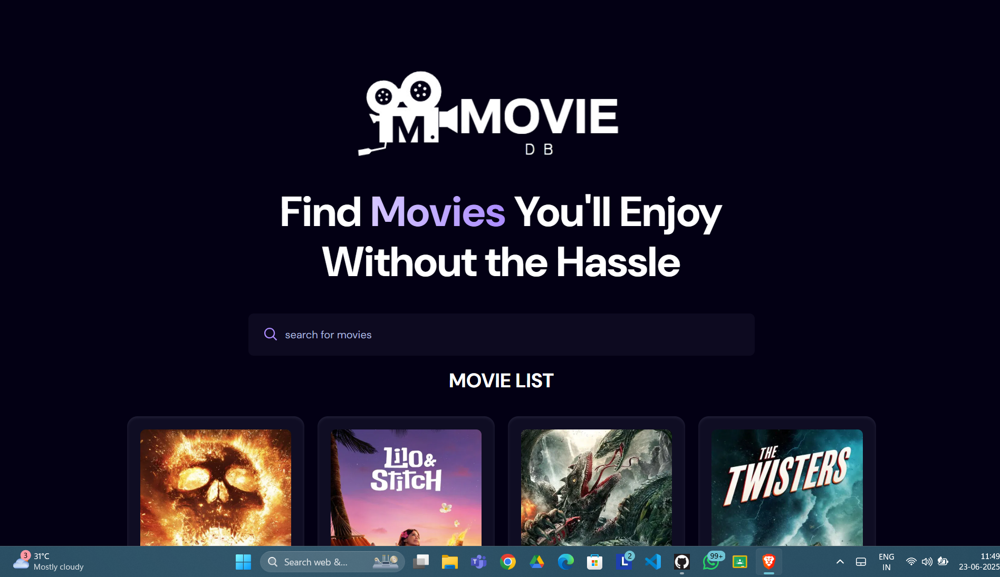

# MOVIE SEARCH APP
*Company name*: CODTECH IT SOLUTIONS

*Name*: Swaranjit Banerjee

*Intern ID*: CT04DG1901

*Domain*: React Web Development

*Duration*: 4 weeks

*Mentor*: Neela Santosh

# 

**Movie_DB** is a modern, interactive web application that allows users to **search for movies, view detailed information, and watch trailers** using **The Movie Database (TMDb) API**. Built with **React**, **Vite**, and **Tailwind CSS**,it offers a fast, seamless user experience with a clean and responsive design.

## 🚀 Features

- 🔎 **Movie Search** – Search movies by title
- 🎥 **Watch Trailers** – Instantly view official trailers on the same page
- ⭐ **Ratings & Overview** – Get details like ratings, overview, release date, etc.
- 📂 **Categories** – Browse by Popular, Top Rated, Upcoming
- 💻 **Responsive UI** – Fully optimized for desktops, tablets, and smartphones
- ⚡ **Built with Vite** – Lightning-fast development and builds
- 🖼️ **Optimized Images** – Lazy loading for faster page speed

## 📸 Screenshot


## 🛠️ Tech Stack

- **Frontend:** React, Vite
- **Styling:** Tailwind CSS
- **API:** The Movie Database (TMDb)

## 🌐 Live Demo

[🔗 View Live](https://movie-db-six-lime.vercel.app/) 

## 📂 Folder Structure
Movie_DB/
├── public/
├── src/
│ ├── components/
│ └── App.jsx
├── README.md
└── package.json


## ⚙️ Installation & Setup

1. **Clone the repository**
   ```bash
   git clone https://github.com/devswaranjit-codes/Movie_DB.git
   cd Movie_DB
2. **Install Dependency**
   ```bash
    npm install

3. **Create ENV file **
   ```bash
   VITE_TMDB_API_KEY=your_tmdb_api_key_here

4. **Run the development server**
   ```bash
   npm run dev

# 🧩 Upcoming Features

✅ Full Movie Streaming (optional legal verification required)

📂 Watch History (localStorage)

🗂️ User Profiles with Watchlists

🎨 More UI Customization

# 🤝 Contributing
Contributions, issues, and feature requests are welcome!
i) Fork this repository

ii) Create a new branch (git checkout -b feature/YourFeature)

iii) Commit your changes (git commit -m 'Add YourFeature')

iv) Push to your branch (git push origin feature/YourFeature)

v) Open a Pull Request

# 📝 License
This project is licensed under the MIT License.

# 🙌 Acknowledgements
TMDb API

React

Tailwind CSS

Vite


   Developed by: Swaranjit Banerjee

  🔗 Portfolio: https://swaranjitbanerjee.live
